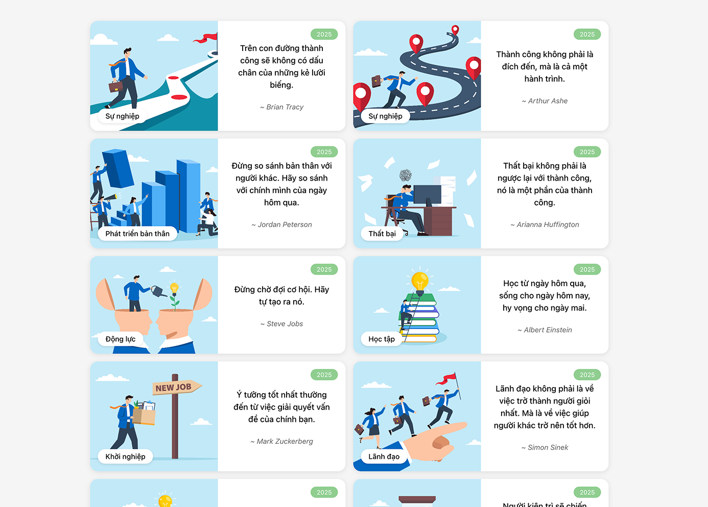

# Danh Ngôn - Ứng Dụng React

Ứng dụng web hiển thị các danh ngôn truyền cảm hứng được xây dựng bằng React.

Đây là một ứng dụng web đơn trang (SPA) hiển thị bộ sưu tập các câu danh ngôn truyền cảm hứng từ những người nổi tiếng trên thế giới. Mỗi danh ngôn được hiển thị trong một card đẹp mắt với hình ảnh minh họa, được phân loại theo chủ đề khác nhau như sự nghiệp, động lực, học tập, etc.



## ✨ Tính năng

- Hiển thị danh ngôn với giao diện card trực quan
- Phân loại danh ngôn theo chủ đề
- Thiết kế responsive, tương thích với nhiều thiết bị
- Giao diện người dùng hiện đại và thân thiện

## 🚀 Công nghệ sử dụng

- React.js
- CSS3 (Grid & Flexbox)
- Create React App

## 🛠️ Cài đặt

1. Clone repository:
```bash
git clone https://github.com/AlexCyberlead/danh-ngon
```

2. Di chuyển vào thư mục dự án:
```bash
cd danh-ngon
```

3. Cài đặt các dependencies:
```bash
npm install
```

4. Chạy ứng dụng ở môi trường development:
```bash
npm start
```

Ứng dụng sẽ chạy tại [http://localhost:3000](http://localhost:3000)

## 📁 Cấu trúc thư mục

```
danh-ngon/
├── public/
│   └── images/          # Chứa hình ảnh minh họa
├── src/
│   ├── components/      # Components React
│   ├── App.js          # Component chính
│   └── QuoteCard.css   # Styles cho component
└── README.md
```


## 👤 Tác giả

- Nhóm CYBERLEAD
- Lê Tuấn Anh
- Trần Tuấn Anh
- Bùi Thảo Duyên
